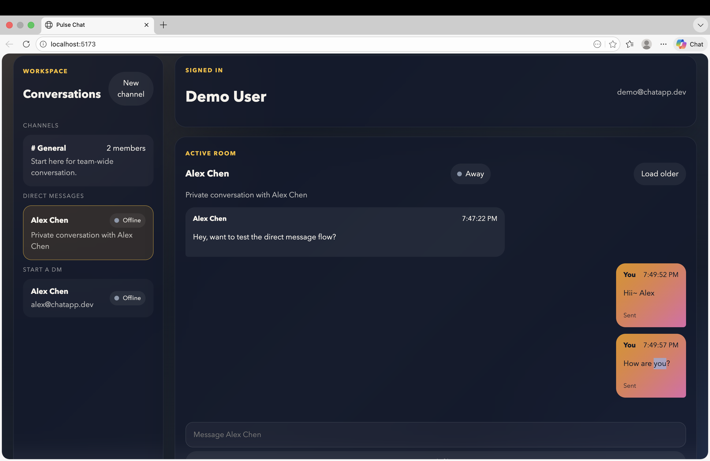

<div align="center">
  <h1>Pulse Chat</h1>
  <p><strong>A polished full-stack real-time chat application built with React, Express, Socket.IO, Prisma, and PostgreSQL.</strong></p>
  <p>Designed as a portfolio-quality project that demonstrates product UI, realtime systems, authentication, database modeling, file uploads, and deployment-ready architecture.</p>
</div>

<div align="center">
  
  
  
  
  
  
  
  
</div>

<div align="center">
  <sub>Add a live demo link here when deployed.</sub>
</div>

<div align="center">
  <a href="#"><strong>Live Demo</strong></a>
  ·
  <a href="#getting-started"><strong>Run Locally</strong></a>
  ·
  <a href="#architecture"><strong>Architecture</strong></a>
  ·
  <a href="#resume-friendly-talking-points"><strong>Resume Points</strong></a>
</div>

## Why This Project Stands Out

- Real-time messaging powered by Socket.IO
- Direct messages with live presence states
- Read receipts and unread count tracking
- Attachment uploads with local or S3-compatible storage
- JWT cookie authentication
- Prisma + PostgreSQL data modeling
- Redis-backed rate limiting for auth, uploads, and message flow
- Docker, Railway, and Vercel friendly setup

## Preview

<p align="center">
  
</p>

<p align="center">
  
</p>

## Portfolio Impact

- Built a production-shaped realtime chat product instead of a toy messaging demo
- Combined REST APIs and WebSocket events in one coherent application architecture
- Implemented authentication, unread counts, read receipts, DMs, uploads, and rate limiting
- Structured the app as a monorepo with separate frontend, backend, and shared type layers
- Prepared the project for local Docker workflows and cloud deployment targets

## Product Vision

Pulse Chat was designed to feel like a lightweight modern collaboration tool rather than just a CRUD demo. The goal was to build something that proves real product thinking:

- fast realtime communication
- clear separation between channels and direct messages
- feedback-rich UI through presence, unread counts, and read receipts
- production-aware infrastructure choices such as rate limiting, storage abstraction, and deployment configuration

## What Users Can Do

- Create an account and log in securely
- Join channels and start direct message threads
- Send real-time messages with typing indicators
- See unread counts and read receipts
- Upload attachments
- View online or away presence states
- Browse paginated message history

## Stack

- Frontend: React + TypeScript + Vite + Tailwind CSS
- Backend: Node.js + Express + Socket.IO
- Database: PostgreSQL + Prisma
- Auth: JWT stored in an `httpOnly` cookie
- Deployment: Vercel (frontend), Railway (backend), Supabase or Railway Postgres (database)

## Architecture

- Frontend: React app with a responsive chat dashboard and live Socket.IO updates
- Backend: Express API plus Socket.IO server for realtime events
- Database: PostgreSQL with Prisma models for users, rooms, memberships, messages, and reads
- Auth: JWT cookie sessions with protected routes
- Storage: local uploads for development, S3-compatible object storage for production
- Abuse protection: Redis-backed rate limiting with in-memory fallback for local development

### System Design

```text
React + Vite Client
    |
    |  HTTP + Cookies
    v
Express API -----------------------> Prisma ORM -----------------------> PostgreSQL
    |
    |  WebSocket events
    v
Socket.IO Server
    |
    +--> Presence updates
    +--> Typing indicators
    +--> Message delivery
    +--> Read receipt updates

Optional production services:
- Redis for distributed rate limiting
- S3 / Cloudflare R2 for durable attachment storage
```

## Key Features

- Authentication with registration, login, and session persistence
- Channel-based messaging and direct message conversations
- Live presence, typing indicators, and realtime message delivery
- Read receipts and unread counters
- Attachment uploads
- Message history with cursor pagination
- Responsive dashboard UI
- Dockerized local development workflow
- Deployment configuration for Vercel and Railway

## Monorepo Layout

```text
apps/
  server/   Express, Prisma, Socket.IO backend
  web/      React + Tailwind frontend
packages/
  shared/   Shared TypeScript types
```

## What I Built

- A polished multi-panel chat interface with both channels and DMs
- A realtime event pipeline using Socket.IO for messaging, typing, receipts, and presence
- A relational Prisma schema for chat rooms, memberships, messages, and read states
- Attachment upload handling with support for local storage or S3-compatible storage
- Production-minded protections like rate limiting and deployment-ready configuration

## Engineering Challenges

### 1. Keeping realtime state and API state aligned

The app mixes REST endpoints and Socket.IO events. That creates a common challenge: some state arrives through HTTP and some arrives through live events. I handled this by keeping shared types in a central package and making the frontend update room lists, unread counts, and message history from both API responses and socket events.

### 2. Designing chat data for both channels and DMs

Rather than building separate message systems, the app models both channels and direct messages through the room system. That keeps the backend simpler while still allowing different UI behavior and metadata for each conversation type.

### 3. Moving beyond a toy demo

A lot of chat demos stop at “messages appear instantly.” This project goes further by including unread counts, read receipts, file uploads, presence, and rate limiting, which makes the system feel closer to a real product.

## Tradeoffs

- JWT cookies keep auth simple and secure for this project, though larger production systems may eventually want refresh token rotation and session tracking
- Local uploads are convenient for development, but durable production storage should use S3-compatible object storage
- In-memory rate limiting is acceptable for local work, but Redis is the right choice once multiple backend instances are involved
- Socket.IO provides an excellent developer experience for realtime features, even though it adds operational complexity compared to a pure REST app

## What I Learned

- How to model realtime collaboration data without losing API clarity
- How to keep frontend and backend contracts aligned with shared TypeScript types
- How to combine REST endpoints with WebSocket events in the same product
- How to structure a small monorepo for frontend, backend, and shared packages
- How to design a chat UI that feels polished while still being practical to ship

## If I Had More Time

- Add end-to-end encryption for private conversations
- Add mentions, notifications, and unread inbox summaries
- Add message search and room member management
- Add image previews and richer attachment rendering
- Add observability with structured logs, metrics, and error tracking

## Getting Started

### 1. Install runtime tools

You need Node.js 20+ and npm 10+ installed locally.

### 2. Install dependencies

```bash
npm install
```

### 3. Configure environment variables

Copy the examples and fill in your own values.

```bash
cp apps/server/.env.example apps/server/.env
cp apps/web/.env.example apps/web/.env
```

### 4. Set up the database

Point `DATABASE_URL` at PostgreSQL, then run:

```bash
npm run db:generate
npm run db:migrate
npm run db:seed
```

### 5. Start the app

```bash
npm run dev
```

The frontend runs on `http://localhost:5173` and the backend on `http://localhost:4000`.

### Docker alternative

If you want the full stack in containers:

```bash
docker compose up --build
```

That brings up:

- Postgres on `5432`
- Redis on `6379`
- Backend on `4000`
- Frontend preview on `4173`

### Production add-ons

For the best production setup:

- Set `STORAGE_PROVIDER=s3` and point the S3 variables at AWS S3, Cloudflare R2, or another S3-compatible bucket
- Set `REDIS_URL` to Upstash, Railway Redis, or another managed Redis instance
- Keep `PUBLIC_FILE_BASE_URL` only for local-disk storage mode

## Realtime Events

Client events:

- `room:join`
- `message:send`
- `typing:start`
- `typing:stop`
- `message:read`

Server events:

- `message:new`
- `typing:update`
- `presence:update`
- `receipt:update`
- `room:joined`
- `error:event`

## API Overview

- `POST /auth/register`
- `POST /auth/login`
- `POST /auth/logout`
- `GET /auth/me`
- `GET /rooms`
- `POST /rooms`
- `POST /rooms/:roomId/join`
- `GET /users`
- `POST /directs/:userId`
- `GET /messages/:roomId`
- `POST /messages/:roomId/read`
- `POST /uploads`

## Resume-Friendly Talking Points

- Built a real-time chat platform with channels, direct messages, presence, read receipts, unread counts, and file uploads
- Developed a full-stack monorepo using React, Express, Socket.IO, Prisma, and PostgreSQL
- Implemented JWT cookie authentication and Redis-backed rate limiting for production-minded reliability
- Designed a responsive chat dashboard with a polished multi-panel messaging experience

## Recruiter Summary

This project demonstrates:

- frontend product design and responsive UI execution
- realtime systems thinking with WebSocket event flows
- backend API design and authentication
- database schema design with Prisma and PostgreSQL
- practical production concerns like uploads, rate limiting, and deployment setup

## Deployment

### Vercel

- Deploy `apps/web`
- Set `VITE_API_URL` and `VITE_SOCKET_URL`
- Config is included in [apps/web/vercel.json](/Users/sujam/projects/real-time-chatapp/apps/web/vercel.json)

### Railway

- Deploy `apps/server`
- Set `DATABASE_URL`, `JWT_SECRET`, `CLIENT_ORIGIN`
- Optional but recommended: `REDIS_URL`
- For durable uploads set `STORAGE_PROVIDER=s3` plus `S3_BUCKET`, `S3_REGION`, `S3_ENDPOINT`, `S3_ACCESS_KEY_ID`, `S3_SECRET_ACCESS_KEY`, and `S3_PUBLIC_BASE_URL`
- Config is included in [apps/server/railway.json](/Users/sujam/projects/real-time-chatapp/apps/server/railway.json)

### Database

- Use Supabase Postgres or Railway Postgres
- Run Prisma migrations against production before releasing
- Redis rate limiting falls back to in-memory counters if `REDIS_URL` is not set, which is okay for local development but not ideal for multi-instance production

## Demo Credentials

After seeding:

- `demo@chatapp.dev` / `password123`
- `alex@chatapp.dev` / `password123`

## Future Improvements

- Add end-to-end encryption for message bodies
- Add push notifications and mentions
- Add moderation queues, admin tooling, and content scanning
